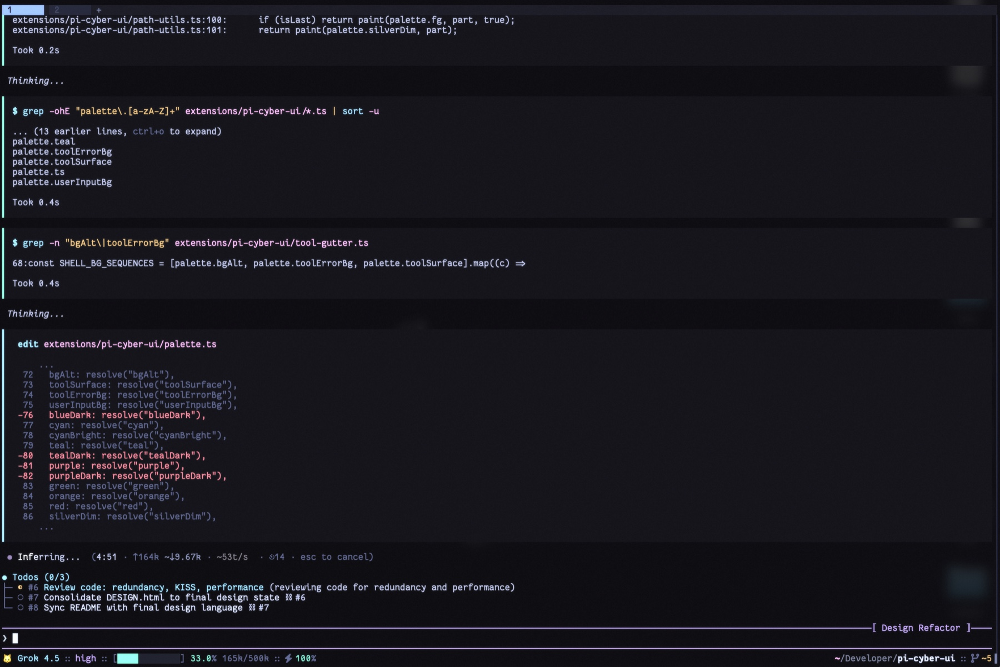
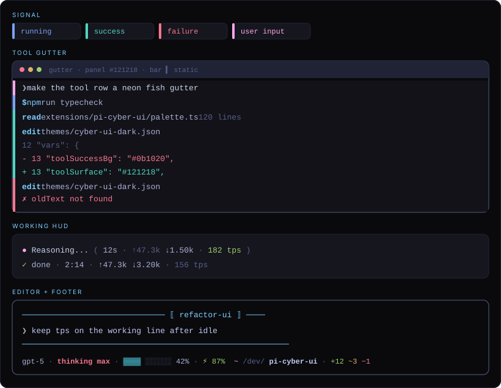

# pi-cyber-ui

Tokyo Night–derived theme + UI for [Pi](https://pi.dev). Status lives in the bar. Motion stays in the HUD.

<p align="center">
  
</p>

## Features

- Silver `❯` editor — thinking/bash border, session label `⟦ name ⟧`
- Neon tool gutter — static `▍` on one slate panel, every tool
- Working HUD — letter-wave verb, pink/cyan `●`, idle `✓ done`
- Compact footer — model · thinking · context · cache · path · git

## Surfaces

<p align="center">
  
</p>

Built-in calls use [tokyonight fish](https://github.com/folke/tokyonight.nvim/blob/main/extras/fish_themes/tokyonight_night.theme) roles: command cyan · param muted · quote silver · `$VAR` green.

Live reference: [`design/DESIGN.html`](https://22gnus.github.io/pi-cyber-ui/design/DESIGN.html)

## Install

```bash
pi install npm:pi-cyber-ui
# or from git:
pi install git:github.com/22GNUs/pi-cyber-ui.git
```

`/settings` → theme `cyber-ui-dark`. Requires Pi `>=0.82.1`.

## Config

Optional `~/.pi/agent/pi-cyber-ui.json`. Missing file/fields use defaults; `/reload` after edit.

```json
{
  "toolHighlight": "gutter",
  "userMessageStyle": "prompt"
}
```

| Key | Values | Default |
|-----|--------|---------|
| `toolHighlight` | `gutter` / `blocks` | `gutter` |
| `userMessageStyle` | `prompt` / `block` | `prompt` |

## Dev

```bash
npm install && npm test && npm run typecheck
```

## Release

Bump `version`, push a matching `vX.Y.Z` tag. GitHub Actions publishes to npm.

## License

MIT
